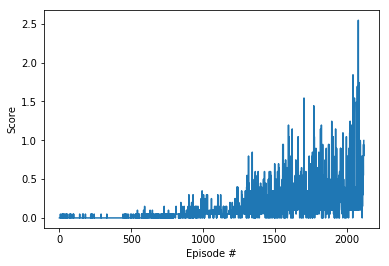
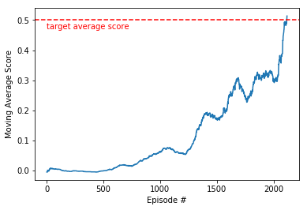
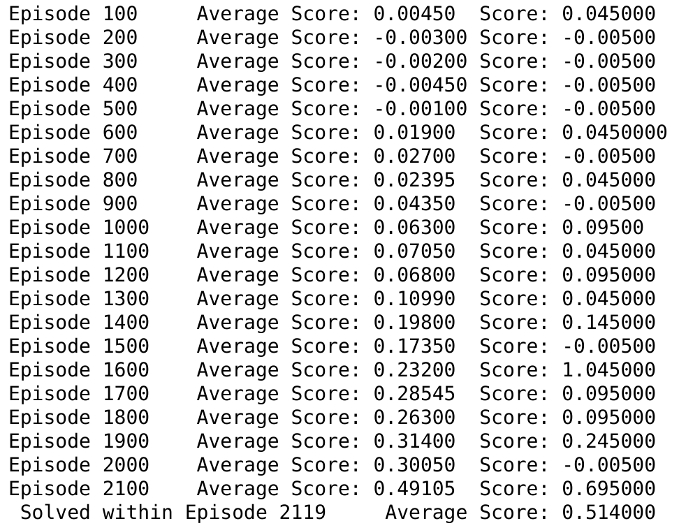

[//]: # (Image References)

[image1]: https://user-images.githubusercontent.com/10624937/42135623-e770e354-7d12-11e8-998d-29fc74429ca2.gif "Trained Agent"

# Project 3: Tennis with MADDPG Report

### Problem Statement/Environment Introduction:

![Trained Agent][image1]

##### Rewards:
- **If an agent hits the ball over the net, it receives a reward of +0.1.**
- **If an agent lets a ball hit the ground or hits the ball out of bounds, it receives a reward of -0.01**

##### State Space
The state space consists of 24 variables corresponding to the position and velocity of the ball and racket. Each agent receives its own, local observation.

##### Actions:
Each agent have it's own action space of two continuous actions corresponding to movement toward (or away from) the net, and jumping.

##### Succesful Completion Criteria
The task is episodic, and in order to solve the environment, your agent must get an average score of +0.5 over 100 consecutive episodes.

### Learning Algorithm 

##### Algorithm: MADDPG
DDPG stands for Deep Deterministic Policy Gradient. The main methodology of this algorithm is to represent both the Q-Value(Critic) and Actor as a neural network. Critic will then try to learn to generate state-action pairs by comparing it's output from previous experiences, while Actor try to learn how to maximize the Q-value generated from the critic.

MADDPG (Multi Agent Deep Deterministic Policy Gradient) the algorithm we use to solve this problem is an extension of DDPG. Where each agent in the envrionment will be represented as a DDPG agent. MADDPG is a centralized training decentralized execution, in the sense that during training, each agent's critic network will have access to all the other agent's states. While during execution, where agent only use actor network, it will only have access to it's own states. MADDPG is a two step algorithm:

**1.Sample Step**
In this step, given the current state we are in, we use our *actor* networks from every agent to choose an action for themselves, and apply Ornstein-Uhlenbeck Noise to add some exploration and randomness. Then we interact with the environment and store/record the interaction (state, action, reward, next\_state, done) into the <em>replay buffer</em> for later learning use.

for each agent:
```
actions_from_all_agents = []
for agent_iter in self.list_of_agents:
    action_from_nn += agent_iter.actor_local_network(current_state)
    noise = agent_iter.OUNoise.sample()
    actions_from_all_agents += np.clip(action_from_nn + noise, -1.0, 1.0)
```

**2.Learn Step**
We sample a batch of experiences from the learning buffer and update our networks with this loss function for each agent:

**Critic Loss:**
We can use current agent's critic network and flattened state-action pair from all agents to obtain Q-value prediction. Then we use next\_states and feed each next\_states to their respective target actor network to predict next\_actions for all agent. We then stack them together to feed it to the current agent's critic network to predict next state-action pairs Q-values for current agent. Then we use current rewards for the current agent and predicted next state-action pairs Q-values to do a TD-0 estimate to estimate the true Q-value and use it as a label. we then apply MSE loss on the Q-prediction and label.

For every agent where each agent will have different experiences/batch samples:
```
Q_prediction = self.critic_local(states.flatten(), actions.flatten())
for agent_iter in self.list_of_agents:
    next_actions += agent_iter.actor_target(next_states[agent_iter.idx])
Q_label = rewards[cur_agent_idx,:] + (gamma * self.critic_target(next_states.flatten(), next_actions.flatten()) * (1-donespcur_agent_idx,:]))
loss = mse_loss(Q_prediction,Q_label)
```

**Actor Loss:**
We feed in the current state of each agent to their corresponding actor network The actor to predict actions given current states. Then we add these states-predicted action pair into critic and get it's negative-mean value of the output. The intuition is we want the action network to learn how to maximize it's predicted score(which is obtained/decided from the critic network).

For every agent where each agent will have different experiences/batch samples:
```
for agent_iter in self.list_of_agents:
    actions_pred += agent_iter.actor_local(states[agent_iter.idx,:])
actor_loss = -self.critic_local(states.flatten(),actions_pred.flatten()).mean()
```

**Mods to stabilize Training**
We are using fixed target learning with soft updates. i.e *_target and *_local are networks with exactly same structure. *_target is technically an interpolated version of *_local from previous iterations. This is done S.T we can have a more stable learning to prevent <em>moving target</em> problem and stabilize training. Moreover we also add some scaling to the noise S.T at later time in training, as our network gets better, we will rely lesser and lesser on the noise.

We are also only updating after certain time steps, and during that time step we learn multiple times. This is also to stabilize training.

##### Hyperparameters

Model/Agent Parameters:
```bash
BUFFER_SIZE = int(1e6)  # replay buffer size
BATCH_SIZE = 256         # minibatch size
GAMMA = 0.99            # discount factor
TAU = 1e-3              # for soft update of target parameters
LR_ACTOR = 1e-3         # learning rate of the actor
LR_CRITIC = 1e-4        # learning rate of the critic
WEIGHT_DECAY = 0.0      # L2 weight decay

N_LEARN_UPDATES = 10     # number of learning updates
N_TIME_STEPS = 20       # every n time step do update

EPSILON_MIN = 0.01      # Minimum scaling to noise
EPSILON_MAX_STEPS = 1e6 # Number of learn iteration before minimum noise scale
```

Runtime parameters:
```bash
- n_episodes = 10000  # Number of epsiodes we trained on
- max_tstep = 1000   # Max number of time step agent runs on during training
```


#### Neural Network Architecture

**Actor network:**
The main important factor of the actor's NN architecture is to have input as large as the state space, and output layer as large as action space. Since the input is vector, we can use FC Networks. For this problem we use a simple 3-Layer FC with leaky Relu activation to represent non-linearity. Additionally since we need the output to have value between [-1,1] we use tanh for the activation on output layer. We are also using batchnorm after first layer for more stable learning. Hence  the layers becomes:

1. FC-Layer(24, 256)
2. leaky_relu(256)
3. batch_norm(256)
4. FC-Layer(256, 128)
5. leaky_relu(128)
6. FC-Layer(128, 2)
7. tanh(2)

**Critic network:**
The important factor is it takes in (num of agent * (state size + action size) in the first layer, since we will combine state and action of all agents together and flatten them out to feed into fc1. Output will be 1 since the Q-value for state-action pair is size 1. We use 4-Layer FC with leaky relu activation for non-linearity. We are also using batchnorm after first layer for more stable learning.

1. FC-Layer(52, 256) ***52 from num_agent * (state\_size + action\_size)***
2. batchnorm(256)
3. leaky_relu(256)
4. FC-Layer(256, 128)
5. leaky_relu(128)
6. FC-Layer(128, 64)
7. leaky_relu(64)
8. FC_layer(64,1)


### Results
Here is the results of training and playing with the environment. the x-axis represent number of episodes, the y-axis represent score/rewards per episode.
<br/><br/>

<br/><br/>
Here is the moving average, the x-axis represent number of episodes, the y-axis represent current score average over last 100 episodes.
<br/><br/>

<br/><br/>
Here is the training log:
<br/><br/>

<br/><br/>

### Future work
To further improve on our current implementation We can implement:
- Implement Priortized Experience Replay/Weighted sampling for DDPG
- Using only different heads(i.e final few layers) for actor and critic for more performance
- Use more than TD-0[current_reward + critic(next_state,next_action)] (i.e TD-n step, or GAE) for the loss function of DDPG's critic.
